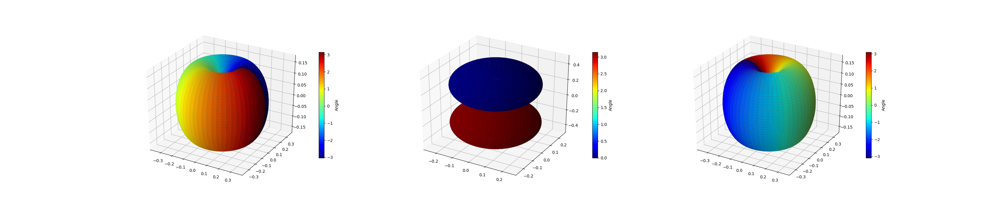

# QuTiP - Quantum Computing Environment Setup Guide

>*Quantum computing is confusing! Setting up your environment shouldn't be!*

QuTiP is a library for python, but most tutorials provided by QuTiP documentation 
demonstrate it with iPython or Jupyter Notebook. The Python purist might scratch their head wondering if these tools are required? The answer is *no*.

This guide shows you how to setup your environment for QuTiP programming. The guide is written specially for `debian` linux, but If you're using another distribution the setup process will be similar.

## Step 1 - Install programs!

I recommend you install the `python3-all` package instead of the regular `python3` package. The `-all` variant  comes with *all* the features of the standard distribution, including the `venv` module used in the next step.

```
$ sudo apt install python3-all
```

Developing and sharing packages is one of the great joys of python programming. However, if you're not careful, your collection of packages can become a disorganized mess! So practice safe programming and use Python Virtual Environments. Virtual environments allow you to manage packages on a per-project-basis rather than installing all packages globally. Bundled with python is a tool called `venv` for creating environments.

```
$ python -m venv venv-learning-qutip
```

Notice a folder called `venv-learning-qutip` was created in your current working directory. This is your virtual environment! Activate the environment by sourcing the `activate` script located in the `/bin` folder as shown. You can tell this environment is active because the prompt is now prefixed with the name of the venv.

```
$ source venv-learning-qutip/bin/activate
(venv-learning-qutip) $
```

Now you can install packages without worrying about cluttering your system, or conflicting with other projects. Anything you install (while the venv is active) will live to this folder. 

Now we can install QuTiP! I recommend installing, QuTiP dependencies *first* then the main QuTiP package. The `pip` package manager is *supposed* to figure everything out, but I ran into errors installing package first. I suspect the QuTiP `setup.py` is not correctly identifying dependencies, confusing pip, but that's a merge request for another day.

```
(venv-learning-qutip) $ pip install --upgrade setuptools
(venv-learning-qutip) $ pip install cython scipy wheel numpy matplotlib
```

Now that the package dependencies are ready you can install `qutip`. If you require a development version of QuTiP that has not been released to PyPI, you will need to clone the QuTiP github repository and build the package from source.

```
(venv-learning-qutip) $ pip install qutip
```

### Step 2 - Systems check!

Everything is installed yay! Let's check everthing works. Create a new file called `main.py`.

```
(venv-learning-qutip) $ touch main.py
```

Open this file in your favorite text-editor and copy in the code below. This code uses the `sphereplot` function in QuTiP that plots a matrix of values on a sphere. Three spheres are created and plotted with `matplotlib`. This little test demonstrates QuTiP is installed and working properly.

```python
import matplotlib.pyplot as plt
import numpy as np
from qutip import *

theta = np.linspace(0,     np.pi, 90)
phi   = np.linspace(0, 2 * np.pi, 60)

fig = plt.figure(figsize=(16,4))

ax = fig.add_subplot(1, 3, 1, projection='3d')
sphereplot(theta, phi, orbital(theta, phi, basis(3, 0)), fig, ax)

ax = fig.add_subplot(1, 3, 2, projection='3d')
sphereplot(theta, phi, orbital(theta, phi, basis(3, 1)), fig, ax)

ax = fig.add_subplot(1, 3, 3, projection='3d')
sphereplot(theta, phi, orbital(theta, phi, basis(3, 2)), fig, ax)

plt.show()
```

Run the `main.py` program. Oh, and cross your fingers!

```
(venv-learning-qutip) $ python main.py
```

Did it work? You should see a chart window appear with three subplots as shown below.

